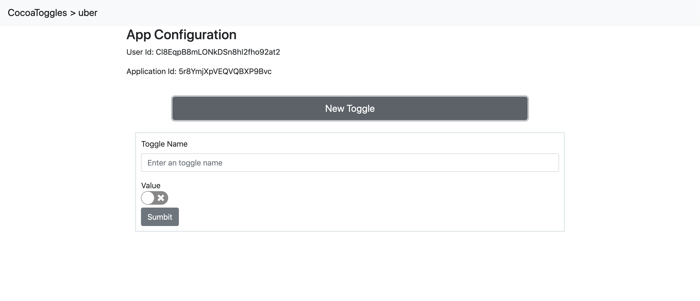
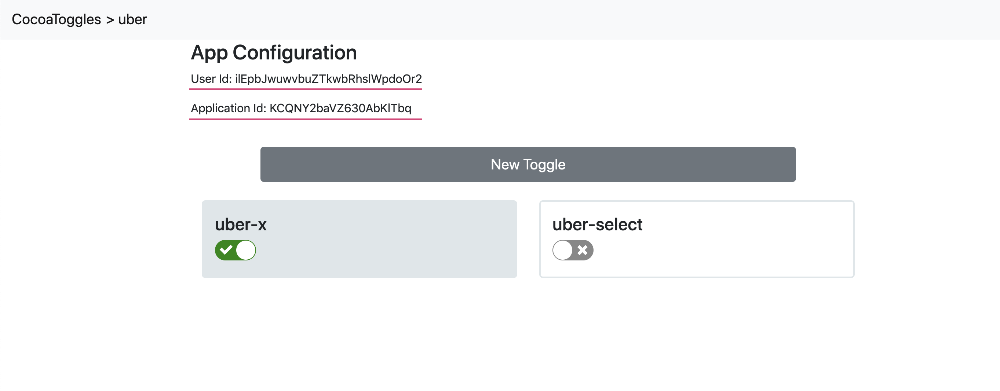

# CocoaToggles

[](https://travis-ci.org/isabellyfd/CocoaToggles)
[](https://cocoapods.org/pods/CocoaToggles)
[](https://cocoapods.org/pods/CocoaToggles)
[](https://cocoapods.org/pods/CocoaToggles)

## Example

To run the example project, clone the repo, and run `pod install` from the Example directory first.

## Installation

CocoaToggles is available through [CocoaPods](https://cocoapods.org). To install 
it, simply add the following line to your Podfile:


```ruby

pod 'CocoaToggles'

```

## Usage

### Creating Toggle Configuration
Go to [Toggle Manager Dashboard](https://toggle-manager.herokuapp.com/) and Sign in with yor prefered email. 


Create an application by clicking the button `New application`.


You should see your application created.


By clicking in your application you'll be able to see the toggle's configuration page of your app. You can add toggles by clicking `New toggle`



You can change your application toggles by switching on and off your toggles. 

Inside each app you will find a configuration to set up your framework from inside your app, such as described in the image bellow: 



### Using the framework itself 

First, set up the configuration of your app's toggles in your ViewController.
```swift 
override func viewDidLoad() {
    super.viewDidLoad()
    let appConfiguration = CTConfiguration("ilEpbJwuwvbuZTkwbRhslWpdoOr2","KCQNY2baVZ630AbKlTbq")
    let toggleManager = CTToggleManager(configuration: configuration)
    toggleManager.delegate = self
    toggleManager.config()
}
```  

Then, make the ViewController implement the CTTogglesDelegate protocol.

```swift
extension ViewController : CTTogglesDelegate {
    func getTogglesFrom(repository: CTRepository) {
        print(repository)
    }
}
```
The repository contains a set of the toggles defined in the dashboard. You can access by using the `isToggleOn` function as described bellow.

```swift
extension ViewController : CTTogglesDelegate {
    func getTogglesFrom(repository: CTRepository) {
        print(repository.isToggleOn(name: "uber-x"))
    }
}
```


## Author

isabellyfd, icfd@cin.ufpe.br


## License

CocoaToggles is available under the MIT license. See the LICENSE file for more info.
